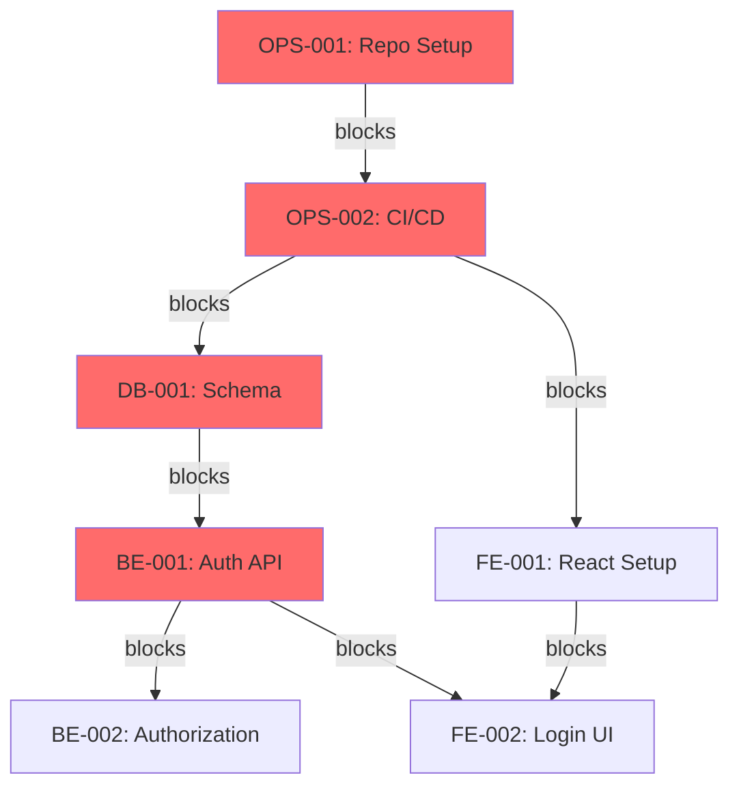

# Task Dependency Map

**Project Name**: [Project name from constitution]  
**Date Created**: [YYYY-MM-DD]  
**Last Updated**: [YYYY-MM-DD]  
**Version**: [v1.0, v2.0, etc.]  
**Owner**: [Planning Agent / PM name]

---

## Purpose of This Document

This Dependency Map visualizes and documents **all task dependencies and sequencing** across the project, enabling effective sprint planning and parallel work optimization.

**What This Document Contains**:
- Visual dependency graphs
- Critical path identification
- Parallel work opportunities
- Dependency types and rationale
- Blocking and blocked-by relationships
- External dependencies

**What This Document Does NOT Contain**:
- Task implementation details (see task-breakdown.md)
- Sprint assignments (see sprint-plan.md)
- Effort estimates (see task-breakdown.md)

**Who Uses This Document**:
- Planning Agent: Sprint planning and sequencing
- Project Manager: Critical path monitoring
- Development Team: Understanding work order
- Technical Leads: Coordination and parallelization

**Traceability**:
- **From**: task-breakdown.md (task inventory)
- **To**: sprint-plan.md (sprint sequencing)
- **Related**: risk-register.md (dependency risks)

---

## Executive Summary

**Total Tasks**: [X] tasks  
**Total Dependencies**: [Y] dependencies  
**Average Dependencies per Task**: [Y/X]

**Critical Path**:
- **Length**: [X] tasks / [Y] days
- **Key Tasks**: [List 3-5 critical path tasks]
- **Risk Level**: [Low/Medium/High]

**Parallelization Opportunity**:
- **Independent Tasks**: [X] ([Y]% of total)
- **Parallel Workstreams**: [X] concurrent tracks possible
- **Max Team Utilization**: [X] developers working simultaneously

**Dependency Types**:
- **Technical**: [X] dependencies
- **Sequential**: [X] dependencies
- **External**: [X] dependencies
- **Resource**: [X] dependencies

**Blocking Risks**:
- **High Risk Dependencies**: [X] tasks (could block ≥5 tasks)
- **External Dependencies**: [X] tasks (outside team control)
- **Critical Path Tasks**: [X] tasks (any delay impacts timeline)

---

## Dependency Types

### Technical Dependencies

**Definition**: Task B requires output/artifact from Task A

**Example**: 
- Frontend login page depends on backend authentication API
- All backend tasks depend on database schema creation

**Notation**: `A → B` (A must complete before B starts)

**Characteristics**:
- Hard constraint (cannot be worked around)
- Most common dependency type
- Usually clear and unambiguous

---

### Sequential Dependencies

**Definition**: Task B should follow Task A for logical/architectural reasons

**Example**:
- API security should be implemented after basic API structure
- User management after authentication

**Notation**: `A ⇒ B` (A should complete before B, but not strictly required)

**Characteristics**:
- Soft constraint (can be violated if necessary)
- Based on best practices or risk management
- May allow limited parallelization

---

### External Dependencies

**Definition**: Task depends on something outside the team's control

**Example**:
- Payment integration depends on merchant account approval
- Deployment depends on infrastructure provisioning

**Notation**: `A ⊳ B` (External dependency blocks B)

**Characteristics**:
- High risk (outside team control)
- May have unpredictable timing
- Requires proactive management and contingency

---

### Resource Dependencies

**Definition**: Tasks compete for the same person/resource

**Example**:
- Two complex backend tasks both need senior backend developer
- Database tasks need DevOps engineer who's also doing infrastructure

**Notation**: `A ⟷ B` (Tasks compete for same resource)

**Characteristics**:
- Manageable through scheduling
- Not a hard blocker (can add resources or sequence)
- Important for sprint capacity planning

---

## Visual Dependency Map

### High-Level Dependency Graph

```
Legend:
→   Technical dependency (hard)
⇒   Sequential dependency (soft)
⊳   External dependency
║   Critical path
┊   Parallel possible
```

```
Sprint 0: Infrastructure Foundation
════════════════════════════════════════════════════════════════

OPS-001: Repository Setup
    ║
    ↓
OPS-002: CI/CD Pipeline ────────┬────────────────────────────┐
    ║                           │                            │
    ↓                           ↓                            ↓
DB-001: Database Schema    FE-001: React Setup    TEST-001: Test Setup
    ║                           ┊                            ┊
    ↓                           ┊                            ┊
DB-002: Seed Data              ┊                            ┊
    ┊                           ┊                            ┊
────────────────────────────────────────────────────────────────

Sprint 1: Authentication
════════════════════════════════════════════════════════════════

DB-001 (complete) ─────→ BE-001: Authentication API
                              ║
                              ↓
                         BE-002: Authorization (RBAC)
                              │
                              ├──────────→ FE-002: Login UI
                              │                ┊
                              ├──────────→ FE-003: Register UI
                              │                ┊
                              └──────────→ TEST-002: Auth Tests
                                               ┊
────────────────────────────────────────────────────────────────

Sprint 2: Core Features
════════════════════════════════════════════════════════════════

BE-002 (complete) ─────→ BE-003: User Management API
                              ┊
                         BE-004: Product Catalog API
                              ┊
                         FE-002 (complete) ──→ FE-004: User Profile UI
                              ┊
                         FE-005: Product List UI
                              ┊
────────────────────────────────────────────────────────────────

Sprint 3: Complex Features
════════════════════════════════════════════════════════════════

BE-004 (complete) ──→ BE-005: Shopping Cart API
                           ║
                           ↓
                      BE-006: Order Processing
                           │
                           ├─────→ FE-006: Cart UI
                           │           ┊
                           └─────→ FE-007: Checkout UI
                                       ┊
────────────────────────────────────────────────────────────────

Sprint 4: Integrations & Payments
════════════════════════════════════════════════════════════════

BE-006 (complete) ──→ INT-002: Payment Gateway ⊳ (Stripe Account)
                           ║
                           ↓
                      BE-007: Payment Processing
                           │
                           └─────→ FE-008: Payment UI
                                       ┊
INT-001: Email Service ⊳ (SendGrid Account)
    ┊
INT-003: SMS Service ⊳ (Twilio Account)
    ┊
────────────────────────────────────────────────────────────────
```

---

## Critical Path Analysis

### Critical Path Definition

The **critical path** is the longest sequence of dependent tasks from project start to end. Any delay in critical path tasks delays the entire project.

### Critical Path Identification

**Critical Path**: OPS-001 → OPS-002 → DB-001 → BE-001 → BE-002 → BE-003 → BE-005 → BE-006 → INT-002

**Path Length**: 
- **Tasks**: 9 tasks
- **Total Duration**: [X] days / [Y] story points
- **Expected Completion**: Sprint [N]

### Critical Path Tasks

| Task ID | Task Name | Duration | Dependencies | Why Critical |
|---------|-----------|----------|--------------|--------------|
| OPS-001 | Repository Setup | 0.5 days | None | Blocks all development |
| OPS-002 | CI/CD Pipeline | 1.5 days | OPS-001 | Blocks automated testing |
| DB-001 | Database Schema | 1.5 days | OPS-002 | Blocks all backend work |
| BE-001 | Authentication API | 2.5 days | DB-001 | Blocks all secured features |
| BE-002 | Authorization | 1.5 days | BE-001 | Blocks role-based features |
| BE-005 | Shopping Cart API | 2 days | BE-004 | Blocks checkout flow |
| BE-006 | Order Processing | 3 days | BE-005 | Blocks payment integration |
| INT-002 | Payment Gateway | 4 days | BE-006 | Blocks revenue features |

**Total Critical Path**: [X] days

**Buffer Available**: [Y] days ([Z]% of critical path)

**Risk Assessment**: [Low/Medium/High]
- **Low**: >30% buffer, tasks well-understood
- **Medium**: 15-30% buffer, some complexity
- **High**: <15% buffer, high complexity or unknowns

### Critical Path Monitoring

**Sprint 0 Critical Milestones**:
- [ ] OPS-001 complete by Day 1
- [ ] OPS-002 complete by Day 3
- [ ] DB-001 complete by Day 5

**Sprint 1 Critical Milestones**:
- [ ] BE-001 complete by Day 3
- [ ] BE-002 complete by Day 5

**Sprint 2-3 Critical Milestones**:
- [ ] BE-005 complete by Sprint 3, Day 3
- [ ] BE-006 complete by Sprint 3, Day 8

**Monitoring Actions**:
- Daily standup focus on critical path tasks
- Weekly critical path review
- Immediate escalation if critical task at risk
- Pre-allocate best resources to critical path

---

## Dependency Matrix

### Task Dependency Table

| Task ID | Task Name | Blocks These Tasks | Blocked By These Tasks | Dependency Type |
|---------|-----------|-------------------|------------------------|-----------------|
| OPS-001 | Repository Setup | OPS-002, FE-001, BE-000, TEST-001 | None | - |
| OPS-002 | CI/CD Pipeline | DB-001, FE-001, BE-001, TEST-001 | OPS-001 | Technical |
| DB-001 | Database Schema | BE-001, BE-002, BE-003, BE-004 | OPS-002 | Technical |
| BE-001 | Authentication API | BE-002, BE-003, FE-002, FE-003 | DB-001 | Technical |
| BE-002 | Authorization | BE-003, BE-004, FE-004 | BE-001 | Sequential |
| FE-001 | React Setup | FE-002, FE-003, FE-004, FE-005 | OPS-002 | Technical |
| FE-002 | Login UI | FE-004, TEST-002 | BE-001, FE-001 | Technical |
| BE-003 | User Management | FE-004, BE-005 | BE-002, DB-001 | Sequential |
| BE-004 | Product Catalog | BE-005, FE-005 | BE-002, DB-001 | Sequential |
| BE-005 | Shopping Cart | BE-006, FE-006 | BE-004 | Technical |
| BE-006 | Order Processing | INT-002, FE-007 | BE-005 | Technical |
| INT-002 | Payment Gateway | BE-007, FE-008 | BE-006, Stripe Account | External |

[Continue for all tasks...]

### Dependency Count by Task

**Most Blocking Tasks** (tasks that block the most other tasks):
1. **OPS-002** (CI/CD Pipeline): Blocks 12 tasks
2. **DB-001** (Database Schema): Blocks 10 tasks
3. **BE-001** (Authentication): Blocks 8 tasks
4. **BE-002** (Authorization): Blocks 6 tasks
5. **FE-001** (React Setup): Blocks 8 tasks

**Most Blocked Tasks** (tasks with most dependencies):
1. **INT-002** (Payment Gateway): 2 dependencies (BE-006 + External)
2. **BE-007** (Notifications): 2 dependencies (BE-001 + External)
3. **FE-008** (Payment UI): 2 dependencies (INT-002 + FE-001)

**Risk Indicator**: Tasks with many dependencies are high-risk

---

## Parallel Work Opportunities

### Sprint 0 Parallelization

**Workstream 1** (DevOps):
```
OPS-001 (Day 1) → OPS-002 (Days 2-3) → OPS-003 (Day 4) → OPS-004 (Day 5)
```

**Workstream 2** (Database - starts Day 4):
```
                                        DB-001 (Days 4-5) → DB-002 (Week 2)
```

**Workstream 3** (Frontend - starts Day 4):
```
                                        FE-001 (Week 2)
```

**Workstream 4** (Testing - starts Day 4):
```
                                        TEST-001 (Week 2)
```

**Team Allocation**:
- Days 1-3: 1 DevOps engineer on critical path (OPS-001, OPS-002)
- Days 4-10: 4 parallel workstreams (needs 4 team members)

---

### Sprint 1 Parallelization

**Workstream 1** (Backend Auth - Critical Path):
```
BE-001 (Days 1-3) → BE-002 (Days 4-5) → BE-003 (Days 6-8)
```

**Workstream 2** (Frontend - After BE-001 completes):
```
                    FE-002 (Days 4-5) ────┐
                                          ├──→ FE-004 (Days 6-7)
                    FE-003 (Days 4-5) ────┘
```

**Workstream 3** (Testing - After BE-001 completes):
```
                    TEST-002 (Days 4-8)
```

**Team Allocation**:
- Days 1-3: 1-2 backend devs on BE-001 (critical path)
- Days 4-8: 3 parallel streams (backend, frontend, testing)

---

### Sprint 2 Parallelization

**Workstream 1** (Backend User Management):
```
BE-003 (Days 1-3) → BE-004 (Days 4-6)
```

**Workstream 2** (Frontend):
```
FE-004 (Days 1-3) → FE-005 (Days 4-6)
```

**Workstream 3** (Testing):
```
TEST-003 (Days 1-6)
```

**Team Allocation**:
- 3 fully parallel workstreams (needs 3 team members)
- Additional team members can work on Sprint 3 prep

---

## External Dependencies

### External Dependency Tracking

| Dependency ID | Description | Required By Task | Required By Date | Owner | Status | Risk |
|---------------|-------------|------------------|------------------|-------|--------|------|
| EXT-001 | Stripe merchant account | INT-002 | Sprint 3, Day 1 | PM | 🟡 In Progress | Medium |
| EXT-002 | SendGrid email account | INT-001 | Sprint 2, Day 1 | DevOps | 🟢 Complete | Low |
| EXT-003 | Twilio SMS account | INT-003 | Sprint 3, Day 1 | DevOps | 🟡 In Progress | Low |
| EXT-004 | Cloud infrastructure approved | OPS-002 | Sprint 0, Day 1 | PM | 🟢 Complete | Low |
| EXT-005 | SSL certificate | OPS-003 | Sprint 0, Day 4 | DevOps | 🟡 In Progress | Medium |
| EXT-006 | Domain name configured | OPS-003 | Sprint 0, Day 4 | PM | 🟢 Complete | Low |

**Legend**:
- 🔴 Blocked / At Risk
- 🟡 In Progress
- 🟢 Complete
- ⚪ Not Started

### External Dependency Mitigation

**For Each External Dependency**:

**EXT-001: Stripe Merchant Account**
- **Lead Time**: 1-2 weeks
- **Action**: Apply 2 weeks before Sprint 3
- **Contingency**: Use Stripe test mode, PayPal as backup
- **Owner**: Project Manager
- **Status Check**: Weekly

**EXT-002: SendGrid Email Account**
- **Lead Time**: 2-3 days
- **Action**: Apply before Sprint 2
- **Contingency**: Console logging for development, Gmail SMTP as backup
- **Owner**: DevOps Engineer
- **Status**: Complete ✓

**EXT-005: SSL Certificate**
- **Lead Time**: 1-3 days (for validation)
- **Action**: Request Day 1 of Sprint 0
- **Contingency**: Self-signed cert for development, Let's Encrypt for staging
- **Owner**: DevOps Engineer
- **Status Check**: Daily in Sprint 0

---

## Resource Dependencies

### Resource Contention Analysis

**Senior Backend Developer** (high demand):
- BE-001 (8 points) - Sprint 1
- BE-006 (8 points) - Sprint 3
- INT-002 (13 points) - Sprint 4

**Resolution**: Spread across sprints, pair with mid-level dev on BE-006

---

**DevOps Engineer** (high demand in Sprint 0):
- OPS-001 through OPS-004 (sequential)
- DB-001 and DB-002 (can delegate DB-002)

**Resolution**: DB-002 can be done by backend developer after training

---

**Frontend Lead** (high demand):
- FE-002, FE-003 (Sprint 1 - can parallelize with another dev)
- FE-006, FE-007, FE-008 (Sprints 3-4 - complex UI work)

**Resolution**: Pair other frontend dev with lead for knowledge sharing

---

### Resource Allocation Matrix

| Sprint | Senior BE Dev | Mid BE Dev | Senior FE Dev | Mid FE Dev | DevOps | QA |
|--------|---------------|------------|---------------|------------|--------|-----|
| Sprint 0 | Setup | Setup | Setup | Setup | 100% util | Setup |
| Sprint 1 | BE-001 (100%) | Support | FE-002/003 (80%) | FE-002/003 (80%) | Support | TEST-002 |
| Sprint 2 | BE-003 (60%) | BE-004 (80%) | FE-004 (50%) | FE-005 (80%) | Support | TEST-003 |
| Sprint 3 | BE-005 (70%) | BE-006 (80%) | FE-006 (70%) | Support | Support | TEST-004 |
| Sprint 4 | INT-002 (100%) | BE-007 (60%) | FE-007/008 (90%) | Support | Support | TEST-005 |

**Utilization Target**: 70-85% (allows for meetings, breaks, unplanned work)

---

## Dependency Risk Assessment

### High-Risk Dependencies

**Risk Level Criteria**:
- **Critical**: On critical path + blocks ≥5 tasks
- **High**: On critical path OR blocks ≥5 tasks
- **Medium**: Blocks 2-4 tasks
- **Low**: Blocks 0-1 tasks

| Task ID | Task Name | Blocks | Critical Path | Risk Level | Mitigation |
|---------|-----------|--------|---------------|------------|------------|
| OPS-002 | CI/CD Pipeline | 12 | Yes | 🔴 Critical | Start Day 1, experienced DevOps, daily monitoring |
| DB-001 | Database Schema | 10 | Yes | 🔴 Critical | Design review, senior oversight, start early |
| BE-001 | Authentication | 8 | Yes | 🟠 High | Experienced dev, pair programming, architecture spike |
| BE-006 | Order Processing | 5 | Yes | 🟠 High | Clear requirements, early design, testing |
| INT-002 | Payment Gateway | 3 | Yes | 🟠 High (External) | Early merchant setup, backup provider |

### Mitigation Strategies

**For Critical Dependencies**:
1. **Assign best resources**: Most experienced developers
2. **Start early**: Don't wait until forced by schedule
3. **Daily monitoring**: Check progress every standup
4. **Build buffers**: Add extra time in estimates
5. **Have contingencies**: Backup plans ready

**For External Dependencies**:
1. **Long lead time**: Start process weeks early
2. **Regular follow-up**: Weekly status checks
3. **Escalation path**: Know who to escalate to
4. **Backup options**: Alternative providers identified
5. **Mock/stub**: Ability to develop without real integration

---

## Dependency Change Management

### When Dependencies Change

**Process**:
1. **Identify Change**: What dependency is changing?
2. **Impact Analysis**: What tasks are affected?
3. **Update Dependencies**: Revise dependency map
4. **Adjust Sprint Plan**: Update sprint-plan.md
5. **Communicate**: Notify affected team members
6. **Update Documentation**: Keep this document current

### Example Change Scenarios

**Scenario 1: New Dependency Discovered**
- Document new dependency
- Assess impact on critical path
- Adjust schedule if needed
- Add to risk register if high-risk

**Scenario 2: External Dependency Delayed**
- Activate contingency plan
- Re-sequence dependent tasks
- Consider parallel workarounds
- Update stakeholders on impact

**Scenario 3: Dependency Removed (Simplified)**
- Update dependency map
- Look for new parallel opportunities
- Potentially accelerate schedule
- Update sprint plan

---

## Dependency Tracking Tools

### Manual Tracking (This Document)
- Text-based dependency documentation
- Updated weekly or as dependencies change
- Good for: Small projects, documentation

### Dependency Graphs
- Visual representation using Mermaid, PlantUML, or Graphviz
- Auto-generated from task management system
- Good for: Communication, presentations

### Project Management Tools
- Azure DevOps, Jira, Asana, Monday.com
- Built-in dependency tracking
- Good for: Real-time tracking, collaboration

### Example Mermaid Dependency Graph



---

## Change Log

| Version | Date | Changed By | Changes | Reason |
|---------|------|------------|---------|---------|
| v1.0 | [Date] | [Name] | Initial dependency map | Phase 2 planning |
| v1.1 | [Date] | [Name] | Updated BE-006 dependencies | Requirements clarification |
| v1.2 | [Date] | [Name] | Added EXT-001 external dependency | Stripe integration added |

---

## Notes and Best Practices

### Maintaining This Document

**DO**:
- ✅ Update weekly (minimum)
- ✅ Update immediately when dependencies change
- ✅ Keep visual graphs synchronized with task changes
- ✅ Review with team during sprint planning
- ✅ Escalate high-risk dependencies immediately
- ✅ Use as input for sprint planning

**DON'T**:
- ❌ Let this get stale (becomes useless)
- ❌ Over-document trivial dependencies
- ❌ Ignore external dependencies (they're high-risk!)
- ❌ Forget to communicate changes to affected team members
- ❌ Create dependencies when not necessary (prefer parallel work)

### Dependency Minimization

**Strategies to Reduce Dependencies**:
1. **Design for Independence**: Loosely coupled architecture
2. **Use Interfaces**: Define contracts early, implement independently
3. **Mock Dependencies**: Don't wait for real implementation
4. **Stub External Services**: Develop against stubs/mocks
5. **Parallel Design**: Start multiple features simultaneously when possible

### Working with Dependencies

**When Blocked by Dependency**:
1. **Communicate**: Tell team you're blocked
2. **Work Around**: Find alternative work
3. **Mock It**: Create mock/stub to proceed
4. **Help**: Offer to help unblock the dependency
5. **Escalate**: If critical, escalate to PM

---

**Remember: Dependencies are the #1 cause of schedule delays. Identify them early, manage them proactively, and minimize them when possible.**
